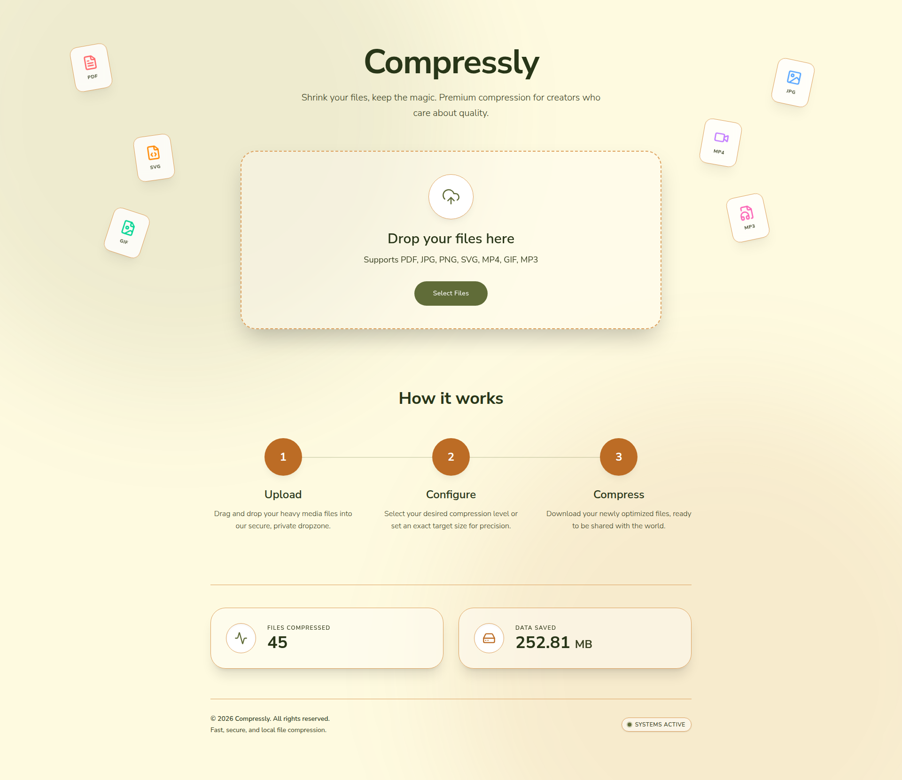
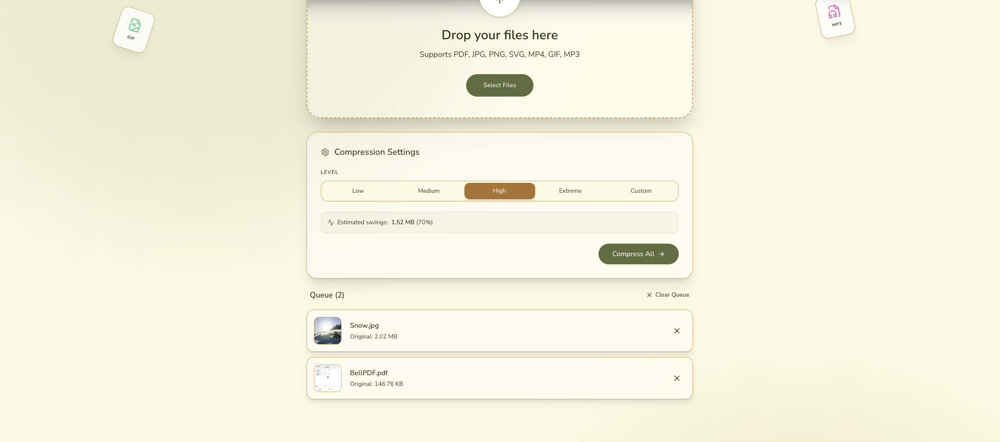
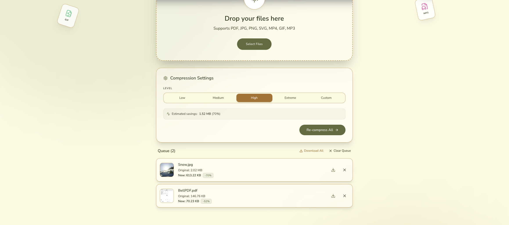

# Compressly

> **Shrink your files, keep the magic.** Premium file compression for creators who care about quality.

[](https://head.compressly-em2.pages.dev/)
[](LICENSE)
[](https://www.typescriptlang.org/)
[](https://vitejs.dev/)

---

## What is Compressly?

Compressly is a **privacy-first file compression tool** that lets you reduce file sizes exactly the way you want — either by choosing a compression level or by targeting a specific output file size. All compression happens **locally in your browser** or on the edge. Your files are **never uploaded to or stored on any cloud server**, so your data stays yours.

---

## Screenshots





---

## ✨ Features

- **🎚️ Compression levels and exact targets** — Pick a level, or set a target size per file. One-click presets for WhatsApp (16 MB), Discord (10 MB), email (25 MB) and form uploads (200 KB / 100 KB).
- **🖼️ Images** — JPG, PNG, WebP, BMP and iPhone HEIC in; same format, JPG, WebP or AVIF out. Optional max dimensions. Before/after comparison slider.
- **📄 PDFs** — "Keep text selectable" re-compresses only the images inside, or "Smallest size" turns pages into images.
- **🎬 Video and audio** — MP4, WebM or GIF output, resolution, remove audio, trim. Audio becomes MP3.
- **🎞️ GIF and SVG** — Animated GIFs keep every frame (gifsicle); SVGs are optimized with SVGO.
- **🔒 Private by design** — Everything runs in your browser. Photo location and camera data is removed unless you choose to keep it.
- **📱 Installable app** — Works offline once loaded; on Android, share files to Compressly from any app.
- **✨ Comfortable to use** — Paste or drop whole folders, cancel any file, per-file options, remembered settings, dark mode.

---

## 🛠️ Tech Stack

| Layer         | Technology                               |
| ------------- | ---------------------------------------- |
| Frontend      | TypeScript, Vite, HTML/CSS               |
| API / Backend | Cloudflare Workers (via `worker/`)         |
| Deployment    | Cloudflare Workers (static assets)       |
| Config        | `wrangler.toml` for Cloudflare settings  |

---

## 🚀 Getting Started

### Prerequisites

- [Node.js](https://nodejs.org/) (v18 or later recommended)
- [npm](https://www.npmjs.com/)
- A [Cloudflare account](https://dash.cloudflare.com/sign-up) (for deployment)

### Installation

```bash
# 1. Clone the repository
git clone https://github.com/HapticHash/compressly.git
cd compressly

# 2. Install dependencies
npm install

# 3. Start the development server
npm run dev
```

The app will be available at `http://localhost:3000` by default.

### Checks

```bash
npm run lint       # type-check
npm test           # unit tests
npm run test:e2e   # browser tests against the production build (Playwright)
```

Run `npx playwright install chromium` once before the browser tests.

### Building for Production

```bash
npm run build
```

The output will be in the `dist/` folder.

---

## ☁️ Deployment (Cloudflare Workers)

Compressly deploys as a **Cloudflare Worker with static assets**: the Vite build in `dist/` is served as static files, and `/api/*` requests are handled by the Worker in `worker/`. Configuration lives in `wrangler.toml`.

```bash
npm run build
npx wrangler deploy
```

With Workers Builds (Git integration), use `npm run build` as the build command and `npx wrangler deploy` (or `npx wrangler versions upload`) as the deploy command.

Use `npx wrangler deploy` rather than `npx wrangler versions upload`: the stats counter is a Durable Object, and the first deploy has to apply its migration, which version uploads can't do.

Optional build-time environment variables:

| Variable | Purpose |
| --- | --- |
| `VITE_SITE_URL` | Public URL used in canonical links, `og:image` and `sitemap.xml` (default: `https://compressly.harshitks2203.workers.dev`) |
| `CF_ANALYTICS_TOKEN` | Enables Cloudflare Web Analytics |

To run the production setup locally, including the API and stats counter:

```bash
npm run build
npx wrangler dev
```

---

## 📁 Project Structure

```
compressly/
├── docs/
│   └── screenshots/  # README images (not deployed)
├── worker/           # Cloudflare Worker: /api/* routes, stats Durable Object
├── tests/e2e/        # Playwright browser tests
├── scripts/          # Generates the PWA icons and og-image.png
├── public/           # Static assets
├── src/
│   ├── components/   # UI components
│   ├── hooks/        # Settings and theme state
│   ├── lib/          # Compression logic, loaded on demand per file type
│   └── sw.ts         # Service worker (offline, caching, share target)
├── index.html        # App entry point
├── vite.config.ts    # Vite configuration
├── wrangler.toml     # Cloudflare Worker config
└── package.json
```

---

## 🔒 Privacy & Security

Compressly is built with privacy as a core principle:

- **Files never leave your device** — All compression runs in the browser (WebAssembly and web workers). No file is uploaded, stored or logged.
- **Metadata removed by default** — Re-encoded photos drop EXIF data such as GPS location, unless "Keep photo metadata" is on.
- **Minimal network use** — The only requests with user activity are an anonymous count of files and bytes saved for the public stats. Fonts and libraries are self-hosted; the FFmpeg core (~31 MB, too large for Cloudflare's 25 MiB file limit) is fetched from unpkg only when you add a video or audio file, then cached.
- **Optional analytics** — If `CF_ANALYTICS_TOKEN` is set at build time, Cloudflare Web Analytics counts page views. It uses no cookies and never sees your files.

You can verify this by inspecting the source code in `worker/` and `src/`.

---

## 🤝 Contributing

Contributions are welcome! Here's how to get started:

1. Fork the repository
2. Create a new branch: `git checkout -b feature/your-feature-name`
3. Make your changes and commit: `git commit -m "feat: add your feature"`
4. Push to your fork: `git push origin feature/your-feature-name`
5. Open a Pull Request

Please make sure your code follows the existing TypeScript conventions and the project builds without errors before submitting.

---

## 📄 License

This project is licensed under the [MIT License](LICENSE).

---

## 🙌 Acknowledgements

Built with ❤️ by [HapticHash](https://github.com/HapticHash). If you find this useful, consider leaving a ⭐ on the repo!
